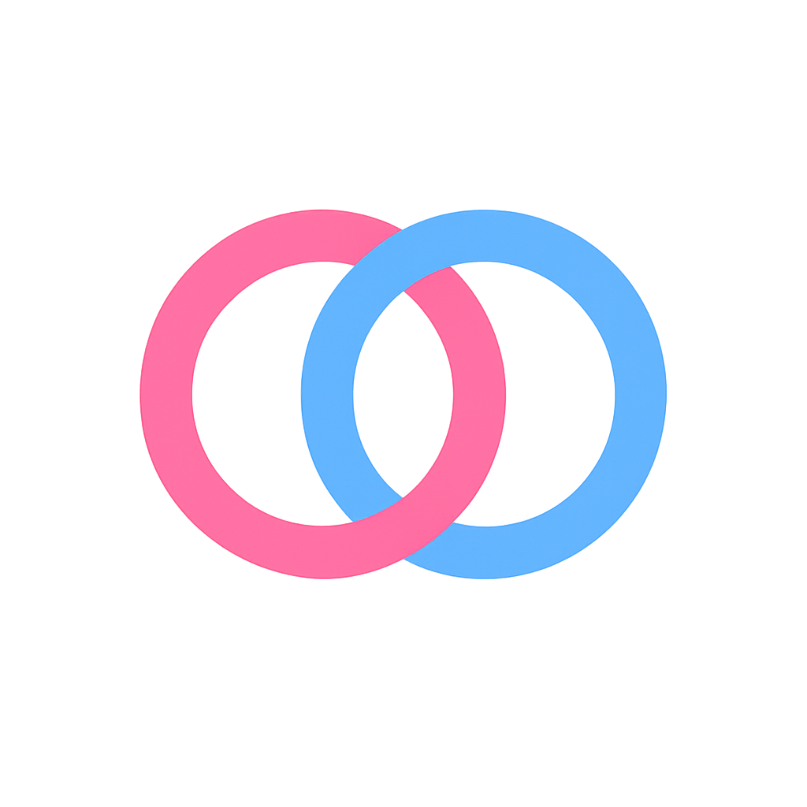
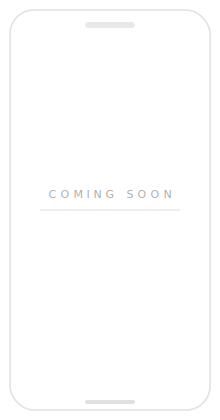

 

# silently share when they cross your mind

 

### ✨ About

HeartSync is a quiet way to stay connected with your favorite person. Whenever they cross your mind, silently send a "heart" without distracting them with annoying notifications. Both of you share a private dashboard to track these moments and view daily, weekly, or yearly graphs showing how much you miss each other.

 

### 🚀 Features

| Feature | Description |
|---|---|
| 🔗 **Partner Pairing** | Link accounts with your partner for a private, shared experience. |
| 🤫 **Silent Hearts** | Send a heart when you think of them without triggering a notification. |
| ❤️ **Live Counters** | Keep a shared log and exact count of who missed who the most. |
| 📈 **Connection Graphs** | View simple daily, weekly, and yearly charts of your shared moments. |

 

### 🐶 Say Hi !!, I dont bite

 

### 📸 Screenshots

 

